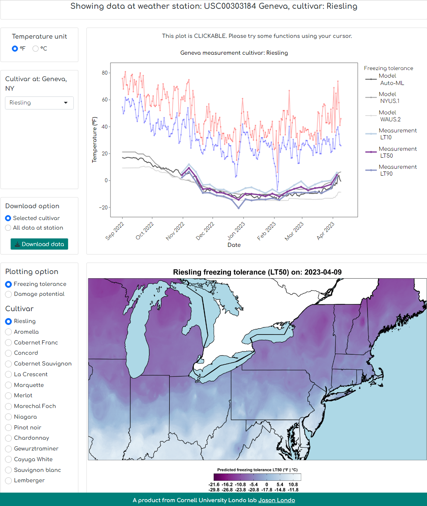

# Update 07/04/2025: NYUS.2.2
NYUS.2.2 is an updated version of the NYUS.2 model. NYUS.2.2 was trained using the original NYUS.2.1 training data (n = 11,277) along with new onsite grapevine freezing tolerance measurement data collected from New York (Geneva, Portland and Hudson Valley), Michigan and Nova Scotia during the 2024-2025 dormant seasons (n = 766). The NYUS.2.2 model was trained using the most recent version of AutoGluon (1.3.1) in Python 3.10.16.  

In addition to the updated training data, we expanded the range of cultivars that the model can predict for cold hardiness. Beyond the original 54 cultivars covered in NYUS.2.1, we added three more cultivars in NYUS.2.2: 'New York Muscat', 'Refosco', 'Teroldego'.  

Ready-to-use NYUS.2.2 model can be download at [here](https://cornell.box.com/s/igaldjbb3o7e8tu0s3exo2yaao04aivb).  

# Update 06/11/2024: NYUS.2.1
NYUS.2.1 is an updated version of the NYUS.2 model. NYUS.2.1 was trained using the original NYUS.2 training data (n = 10,157) along with new onsite grapevine freezing tolerance measurement data collected from various regions in NY during the 2022-2023 and 2023-2024 dormant seasons (n = 1,120). The NYUS.2.1 model was trained using the most recent version of AutoGluon (1.1.0) in Python 3.10.14.  

In addition to the updated training data, we expanded the range of cultivars that the model can predict for cold hardiness. Beyond the original 45 cultivars covered in NYUS.2, we added nine more cultivars in NYUS.2.1: 'Aravelle', 'Aurora', 'Caminante blanc', 'Delaware', 'Elvira', 'Fleurtai', 'Ives', 'Soreli', and 'Vincent'.  

Ready-to-use NYUS.2.1 model can be download at [here](https://cornell.box.com/s/m4wwjt4zeutwc4oc0ekye98xyasglsn1).  

# NYUS.2
NYUS.2 is an automated machine learning-empowered prediction model for grapevine freezing tolerance. This repo includes all the source code for feature extraction, model training and model deployment along with the original training data as parts of the __open-source__ study.

## Folders and files description
### [Raw data processing and feature extraction](https://github.com/imbaterry11/AutoLT50.1/tree/main/Raw%20data%20processing%20and%20feature%20extraction)
__Feature_extraction.R__ is an R script to extract features from daily temperature for the training and prediction of NYUS.2  
__Cultivars.Rdata__ contains all the names for the Boolean-type cultivar columns  
__daily_temperature_data_example.csv__ is an example file to be processed by __Feature_extraction.R__ to generate features  
__daily_temperature_data_example_feature_extracted.csv__ is a resulting file that contains necessary features  
### [Training and feature importance quantification](https://github.com/imbaterry11/AutoLT50.1/tree/main/Training%20and%20feature%20importance%20quantification)
__Autogluon_model_training_feature_importance.ipynb__ is a notebook for the training of NYUS.2 and feature importance quantification  
__All_training_data_9_sites.csv__ is the entire LT50 dataset contributed by nine research facilities for NYUS.2 model training and testing  

### [Using model](https://github.com/imbaterry11/AutoLT50.1/tree/main/Using%20model) 
__NYUS.2_using_the_model.ipynb__ is a notebook for the prediction using NYUS.2  
__daily_temperature_data_example_feature_extracted.csv__ is an example file that contains necessary features for prediction  
__LT50_pred.csv__ is the model prediction  
## Additional information:
Ready-to-use NYUS.2 model can be download at [here](https://drive.google.com/drive/folders/1ZUXO9TCKzXt9-r7k1gZ5Oj0VDRyFb12N?usp=sharing).  
The current model was deployed at [the Cornell grape freezing tolerance prediction app](https://grapecoldhardiness.shinyapps.io/grape_freezing_tolerance/):  

Upon the use of the tools provided in this repo, please cite:  
Wang, Hongrui, Gaurav D Moghe, Al P Kovaleski, Markus Keller, Timothy E Martinson, A Harrison Wright, Jeffrey L Franklin, et al. 2023. “NYUS.2: An Automated Machine Learning Prediction Model for the Large-Scale Real-Time Simulation of Grapevine Freezing Tolerance in North America.” Horticulture Research, December, uhad286. https://doi.org/10.1093/hr/uhad286.

