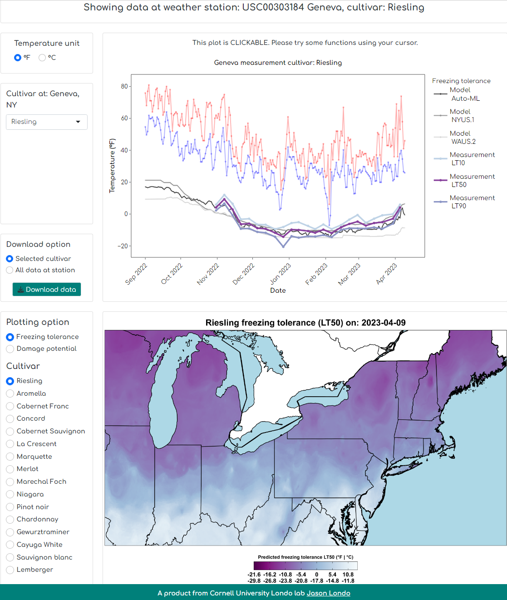

# Update 09/17/2026: NYUS.2.3

NYUS.2.3 updates the grapevine freezing-tolerance model with 21,743 unique LT50
observations. The input consisted of 12,043 NYUS.2.2 records and 9,708 newly
compiled observations; eight exact duplicates in the legacy data were removed
before training.

The row-level sources in `All_training_data_NYUS_2_3_LT50.csv` are:

- NYUS.2.2 open training dataset: 12,035 final unique rows;
- [CCOVI VineAlert Bud Hardiness](https://www.ccovi.ca/vine-alert/bud-hardiness):
  7,978 rows;
- [British Columbia Wine Grape Council Grape Bud Hardiness Report](https://bcwgc.org/report/grape-bud-hardiness-report/),
  associated with Agriculture and Agri-Food Canada research: 1,076 rows;
- Collaborative monitoring program, including Cornell and Michigan State
  monitoring records: 654 rows.

These contributing measurements are publicly available. In keeping with the
open-source purpose of NYUS.2, NYUS.2.3 also releases the complete standardized
LT50 table, including dates, coordinates, cultivar names, LT50 values, and
row-level data-source labels. This allows anyone to reproduce our preparation,
create different features, evaluate alternative algorithms, or train an
independent model using the same open data.

NYUS.2.3 uses temperature-only features generated with UFEED 0.1.1. The model
was trained on all available observations with AutoGluon 1.4.0 and Python
3.10.19. Date, longitude, latitude, and the text cultivar label were excluded
from model fitting; standardized cultivar one-hot columns were retained.

The cultivar vocabulary now contains 69 cultivars. The 12 additions relative
to NYUS.2.2 are: Clarion, Crimson Pearl, Gamaret, Gamay noir, Itasca, Marsanne,
NY06, Petit Meunier, Petit Verdot, Regent, Rkatsiteli, and Verona.

The full AutoGluon ensemble had an internal validation RMSE of approximately
1.1605 degrees C. The distilled `WeightedEnsemble_L2_DSTL` model had an internal
validation RMSE of approximately 1.1197 degrees C. These are internal bagging
validation estimates, not results from an independent external test set.

Downloads:

- [NYUS.2.3 engineered training matrix](https://cornell.box.com/s/1dyu1s116dxtkrqtoerff53hs8h42y33)
- [NYUS.2.3 full AutoGluon model](https://cornell.box.com/s/sf0lbf73qnhilqlamkjw2y8e6vibj51k)
- [NYUS.2.3 light distilled AutoGluon model](https://cornell.box.com/s/atm7k0ld3wtcod8fwrubcma9fvtuea8s)

**Platform compatibility:** the published NYUS.2.3 full and light AutoGluon
model directories are Linux-only. Load them in a Linux environment with Python
3.10 and AutoGluon 1.4.0. They are not supported on native Windows or macOS;
Windows users should use WSL2, Docker, or another Linux environment.

The standardized source LT50 table is included directly under
`Training and feature importance quantification/All_training_data_NYUS_2_3_LT50.csv`.

Important: NYUS.2.3 is not feature-compatible with NYUS.2.2. Two supported
feature-generation approaches are provided:

1. `Feature_extraction_NYUS_2_3_with_UFEED.R` downloads daily temperatures from
   coordinates and dates through UFEED.
2. `Feature_extraction_NYUS_2_3_from_Tmin_Tmax.R` accepts a user's own daily
   minimum and maximum temperature observations.

Both approaches use `Cultivars_NYUS_2_3.Rdata` and enforce the exact predictor
order stored in `NYUS_2_3_model_features.csv`. User-supplied temperatures must
be daily, continuous, correctly identified as Celsius or Fahrenheit, and must
include sufficient weather before the desired prediction dates for rolling and
dormant-season features.

Before running either extractor, install UFEED 0.1.1 and the R packages
`dplyr` and `readr`, then run the script from
`Raw data processing and feature extraction/` (or change its file paths).
For the POWER workflow, set `longitude`, `latitude`, `cultivar`, and the two
prediction dates; leave `weather_data_source <- "power"`. POWER requires an
internet connection but does not require Google Earth Engine or Python
configuration. Only users who deliberately change the source to `power_ee`
need to configure reticulate, Python, and Earth Engine authentication.
The supplied `daily_temperature_data_example_NYUS_2_3.csv` is a continuous
2023-2025 POWER series in degrees Fahrenheit for testing the own-data route.

# Update 07/04/2025: NYUS.2.2
NYUS.2.2 is an updated version of the NYUS.2 model. NYUS.2.2 was trained using the original NYUS.2.1 training data (n = 11,277) along with new onsite grapevine freezing tolerance measurement data collected from New York (Geneva, Portland and Hudson Valley), Michigan and Nova Scotia during the 2024-2025 dormant seasons (n = 766). The NYUS.2.2 model was trained using the most recent version of AutoGluon (1.3.1) in Python 3.10.16.  

In addition to the updated training data, we expanded the range of cultivars that the model can predict for cold hardiness. Beyond the original 54 cultivars covered in NYUS.2.1, we added three more cultivars in NYUS.2.2: 'New York Muscat', 'Refosco', 'Teroldego'.  

Ready-to-use NYUS.2.2 model can be download at [here](https://cornell.box.com/s/igaldjbb3o7e8tu0s3exo2yaao04aivb).  

# Update 06/11/2024: NYUS.2.1
NYUS.2.1 is an updated version of the NYUS.2 model. NYUS.2.1 was trained using the original NYUS.2 training data (n = 10,157) along with new onsite grapevine freezing tolerance measurement data collected from various regions in NY during the 2022-2023 and 2023-2024 dormant seasons (n = 1,120). The NYUS.2.1 model was trained using the most recent version of AutoGluon (1.1.0) in Python 3.10.14.  

In addition to the updated training data, we expanded the range of cultivars that the model can predict for cold hardiness. Beyond the original 45 cultivars covered in NYUS.2, we added nine more cultivars in NYUS.2.1: 'Aravelle', 'Aurora', 'Caminante blanc', 'Delaware', 'Elvira', 'Fleurtai', 'Ives', 'Soreli', and 'Vincent'.  

Ready-to-use NYUS.2.1 model can be download at [here](https://cornell.box.com/s/m4wwjt4zeutwc4oc0ekye98xyasglsn1).  

# NYUS.2
NYUS.2 is an automated machine learning-empowered prediction model for grapevine freezing tolerance. This repo includes all the source code for feature extraction, model training and model deployment along with the original training data as parts of the __open-source__ study.

## Folders and files description
### [Raw data processing and feature extraction](https://github.com/imbaterry11/AutoLT50.1/tree/main/Raw%20data%20processing%20and%20feature%20extraction)
__Feature_extraction.R__ is an R script to extract features from daily temperature for the training and prediction of NYUS.2  
__Cultivars.Rdata__ contains all the names for the Boolean-type cultivar columns  
__daily_temperature_data_example.csv__ is an example file to be processed by __Feature_extraction.R__ to generate features  
__daily_temperature_data_example_feature_extracted.csv__ is a resulting file that contains necessary features  
### [Training and feature importance quantification](https://github.com/imbaterry11/AutoLT50.1/tree/main/Training%20and%20feature%20importance%20quantification)
__Autogluon_model_training_feature_importance.ipynb__ is a notebook for the training of NYUS.2 and feature importance quantification  
__All_training_data_9_sites.csv__ is the entire LT50 dataset contributed by nine research facilities for NYUS.2 model training and testing  

### [Using model](https://github.com/imbaterry11/AutoLT50.1/tree/main/Using%20model) 
__NYUS.2_using_the_model.ipynb__ is a notebook for the prediction using NYUS.2  
__daily_temperature_data_example_feature_extracted.csv__ is an example file that contains necessary features for prediction  
__LT50_pred.csv__ is the model prediction  
## Additional information:
Ready-to-use NYUS.2 model can be download at [here](https://drive.google.com/drive/folders/1ZUXO9TCKzXt9-r7k1gZ5Oj0VDRyFb12N?usp=sharing).  
The current model was deployed at [the Cornell grape freezing tolerance prediction app](https://grapecoldhardiness.shinyapps.io/grape_freezing_tolerance/):  

Upon the use of the tools provided in this repo, please cite:  
Wang, Hongrui, Gaurav D Moghe, Al P Kovaleski, Markus Keller, Timothy E Martinson, A Harrison Wright, Jeffrey L Franklin, et al. 2023. “NYUS.2: An Automated Machine Learning Prediction Model for the Large-Scale Real-Time Simulation of Grapevine Freezing Tolerance in North America.” Horticulture Research, December, uhad286. https://doi.org/10.1093/hr/uhad286.
